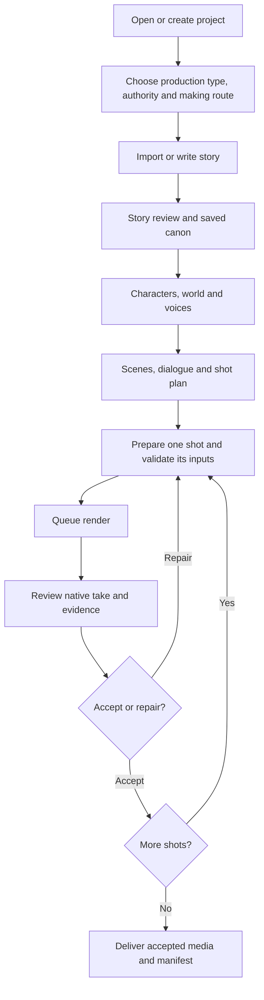

# Customer journeys

**Status:** proposed product arrangement around existing capabilities. This document describes both existing behavior and proposed presentation; catalog evidence determines what is executable.

## 1. Three independent choices

| Choice | Options | Meaning |
|---|---|---|
| Decision authority | Manual / Assisted (Semi) / Autopilot (Full) | Who authors, selects, approves and advances work |
| Making route | Direct / Reference-built / Hybrid | Which accepted assets and conditioning inputs a shot needs |
| Production type | Film, advertisement, news, informative, social profile, corporate pitch; published style variants | Structure and narrative/Director style |

Use customer labels **Assisted** and **Autopilot**, with the current internal values `semi` and `fully_automated` retained. Manual keeps `manual`. Keep route values `direct_h3`, `reference_built`, `hybrid`. These are presentation changes, not rewritten controller contracts.

### The nine combinations

| Making route | Manual | Assisted | Autopilot |
|---|---|---|---|
| Direct | Human prepares text/prompt, optionally adds references, queues and reviews | Director assists text and shot preparation; human gates retained | Director generates supported text/takes and reviews within saved bounds |
| Reference-built | Human chooses/accepts required character and world masters, then renders | Director proposes masters/voices; human selects and approves shot rendering | Director selects supported candidates, builds required masters and proceeds through supported rendering/review |
| Hybrid | Human chooses explicitly required masters and per-shot optional inputs | Director proposes a mix; human gates apply | Controller follows the explicit hybrid asset policy; unavailable automatic choices block visibly |

These are combinations of policies in one pipeline. Do not promise equivalent live acceptance for all nine. The source has representative Manual/Semi paths and Full Direct/Reference acceptance. Each additional combination needs a small named acceptance fixture before claiming it works end to end.

## 2. Main production journey

At every stage, preserve the source/revision that produced the next artifact. Show completed work immediately after opening a project; do not rerun the whole pipeline on navigation.

### Step 1 — Project setup

Provide title, production type and the two independent choices. Then accept story text or reopen existing source. Reference uploads and existing project/library assets are optional here and can be added later. Keep provider/model and workflow specifics in expandable settings.

Before a run starts, show a readable summary of the chosen mode, route, provider and configured render/retry limits. The current backend run configuration remains authoritative. A changed decision policy should create an explicit new run/revision rather than silently mutate an active Full run.

### Step 2 — Story desk

Display original source, proposed canon and revision history. Assisted waits for story approval. Manual can author/revise directly. Autopilot can advance supported review with saved evidence and visible uncertainty/holds. Preserve exact dialogue/language and chunk coverage checks.

### Step 3 — Production bible

Show characters, worlds, voice bindings and accepted masters in named cards. Reference-built route labels missing required masters. Direct route should not force users to generate masters. Hybrid should list its actual required and optional assets explicitly.

Existing default image candidate policy produces four candidates for Manual/Semi and one for Full with bounded retakes. Reuse that policy; do not increase candidate counts as part of a cosmetic redesign. Show previews and why the candidate was proposed. Uploaded and library media use the same acceptance/identity binding rules.

### Step 4 — Scenes and shots

Generate or enter scene structure, ordered dialogue, visual briefs and shot plans. The shot list becomes the primary working surface. Switching scenes resets automatic continuity references according to existing rules. Changing order or replacing a parent take should show which later shots depend on it before a new render is queued.

### Step 5 — Shot desk

Select a shot, choose its supported recipe, edit text and add accepted references. Preserve the compiler's actual ordered image/video/audio slots and asset IDs. Show reference badges corresponding to prompt tags. A rearranged reference order invalidates stale validation/refine proposals.

Present validation separately from **Render**. Validation performs no GPU inference. Display the blockers and missing inputs beside the relevant field. Render creates a durable take/job and remains tied to its saved request.

### Step 6 — Review and iteration

Play the original native video with audio, show take versions and compare required dialogue/reference intent. Separate **Completed**, **Reviewed**, and **Accepted**. Human confirmation binds to the exact video hash. Optional audio overlays are not automatically substituted for native H3 audio.

Accept an exact take; repair the prompt/refs or request a bounded retake. Autopilot can only accept within implemented review policy; uncertainty can require intervention. Preserve recorded `acceptance_checkpoint_hold` and unknown-submission holds when importing existing runs.

### Step 7 — Delivery

Initially provide accepted shot media, separate dialogue/music/Foley assets and a manifest. Label legacy one-video/one-audio composition clearly. Display the composed clip as a new derivative, with the shortest-duration behavior disclosed near that action.

A complete timeline with multi-shot stitching, audio mixing, titles and final-film export is a later workstream with its own acceptance criteria. Do not call today's manifest writer “Export finished film.” Keep the legacy raw output index available separately because it includes unaccepted/intermediate files.

## 3. Approval and authority matrix

| Stage/action | Manual | Assisted | Autopilot |
|---|---|---|---|
| Start run / choose immutable configuration | Human | Human | Human |
| Story review | Human | Human gate | Director within supported policy |
| Image candidate selection | Human | Human gate | Bounded Director selection |
| Voice selection | Human | Human gate | Supported saved selection policy; block unavailable automation |
| Shot workflow and render approval | Human | Human gate | Supported automatic policy with saved limits |
| Take review | Human | Human-facing review | Supported bounded Director review; uncertainty/holds visible |
| Run resume/retry after unresolved submission | Reconcile first | Reconcile first | Reconcile first |
| Optional trainers/unsupported graphs | Explicit expert action | Explicit expert action | Not automatically dispatched |

The four Assisted gates are existing contract names: `story_review`, `image_candidate_selection`, `voice_selection`, `shot_workflow_render_approval`. Avoid adding a global “Approve everything” toggle that bypasses them.

## 4. Specialist journeys

### A. Dialogue with exact timing

Choose Audio → Timed dialogue → write/import SRT → map named speakers to reference voices → select timing mode/language → preview validation and estimated alignment → generate → listen and inspect timing report → split affected sections → change emotion/style/voice or repair selected clips → stitch → save to project/library. Preserve adjusted SRT and report alongside final audio.

Production dialogue is a separate recipe: select run and exact timed lines → bind accepted voice excerpts → use the currently supported speaker count → enqueue VibeVoice → review sidecar → optionally select it as a shot reference. Do not imply the recipe automatically lip-syncs or replaces native H3 speech.

### B. Music and Foley

Music → instrumental/song → tags/lyrics/duration → generate with ACE-Step → listen → save/select for a project. Foley → choose text-only, text+video or reference audio+video → provide that recipe's inputs → generate → review → save. Expert graphs are displayed with adapter/readiness status; unsupported graphs are not normal Render buttons.

### C. Voice and audio repair

Upload/select existing audio → choose one transformation → preview required reference/transcript/model and duration bounds → generate derivative → compare original/output → accept derivative or discard. Batch denoising/extraction/stems belong in Audio Utilities and retain per-item results. Never overwrite originals.

### D. Find inspiration and reusable reference media

Library → upload/search video or review YouTube candidate → download/import → analyze selected source → browse scene clips, transcript, visual/audio evidence → search text or semantic corpus → audition/play reference → link to project → add to the specific shot/reference role. Optional sound isolation is previewed before evidence-backed promotion.

### E. One-off visual generation and expert workflows

Create → Image or Video → select a supported recipe → input validation → generate → review → save to library or attach to a project. Expert tab exposes Wan/LTX/VFX/3D recipes with their own input contracts and readiness; a saved UI graph can be inspected/imported into ComfyUI even when the website cannot execute it.

### F. Custom voice/music model preparation

Settings/Expert → Training resources → engine-specific dataset preparation → validate/preflight → save preparation manifest. StyleTTS2 remains a standalone tool until integrated. F5/ACE disabled training stays disabled. Training launch, checkpoint selection and evaluation need a separate implementation/approval of scope before becoming a product promise.

### G. Reusable audio automation

Automations → select saved pipeline or compose ordered blocks → validate type bindings and executable support → run → inspect each step/outputs → retry from a safe step → save resulting assets. Noise/Demucs missing adapters and non-text Foley bindings must be shown before launch, not discovered after a long run.

## 5. Failure, return and cost behavior

- Save edits and selected context before navigation. Refresh/back/deep links restore the exact project/run/shot.
- A render continues through its existing worker. A tab closing does not duplicate the request.
- Queued/active/review/held/failed states have different actions; use native backend state mappings.
- A stalled client first reads durable job state. Unknown prompt submission is held for reconciliation; never auto-resubmit it.
- Provider budget, retries and heavy workloads are explicit. Preview/validation/navigation do not regenerate media.
- A missing model/node/smoke produces an actionable disabled reason and another compatible recipe only when the user or saved policy chooses it.
- Completed source work is reusable after migration. Accepted IDs, hashes, references and recorded decisions are preserved.
